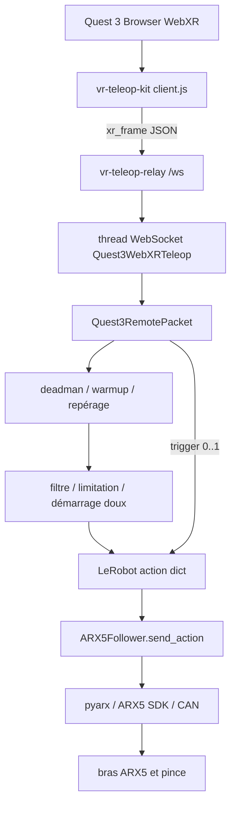

# Téléopération WebXR ARX5 + Quest 3

Langues : [English](README.md) | [中文](README-zh.md) | [Français](README-fr.md)

Descriptions du flux : [English](README_DETAILED_CHAIN.md) | [中文](README_DETAILED_CHAIN-zh.md) | [Français](README_DETAILED_CHAIN-fr.md)

Ce projet compact, inspiré de LeRobot, prend en charge la téléopération d’un bras ou de deux bras ARX5 avec un contrôleur WebXR Quest 3. Commande de démarrage pour un bras :

```bash
lerobot-teleoperate \
  --robot.type=arx5_follower \
  --robot.control_mode=cartesian_control \
  --teleop.type=quest3_webxr \
  --teleop.ws_url=ws://127.0.0.1:8443/ws
```

Le navigateur utilise la page WebXR originale de `vr-teleop-kit` et `vr-teleop-relay`, sans wrapper supplémentaire.

## 1. Structure du projet

```text
arx5-webxr-teleop/
  src/lerobot/
    robots/arx5_follower/
    robots/bi_arx5/
    teleoperators/quest3_webxr/
    teleoperators/bi_quest3_webxr/
    scripts/lerobot_teleoperate.py
  vr-teleop-kit/
    src/vr_teleop_kit/relay/
  examples/
    arx5_tcp_four_point_calibration.py
    quest3_webxr_tcp_pivot_calibration.py
  third_party/ARX5_SDK/
  environment.yml
  pyproject.toml
```

Le paquet `src/lerobot` conserve les conventions de configuration et de ligne de commande de LeRobot. Les téléopérateurs WebXR gèrent la réception des trames, le repérage TCP Quest–ARX5, le filtrage, la limitation de vitesse, le warm-up et le contrôle continu de la pince.

## 2. Installation de l’environnement

### 2.1 Créer l’environnement à partir de zéro

```bash
cd /home/jiang-yifeng/桌面/quest_arx_web/arx5-webxr-teleop
mamba env create -f environment.yml
mamba activate arx5-webxr-teleop
python -m pip install -e .
python -m pip install -e ./vr-teleop-kit
python -m pip install -e ./third_party/ARX5_SDK --no-build-isolation --no-deps
```

### 2.2 Compléter les dépendances d’un environnement existant

Si une installation précédente avec `--no-deps` a omis les dépendances :

```bash
mamba activate arx5-webxr-teleop
python -m pip install fastapi uvicorn[standard] draccus websockets huggingface-hub spdlog termcolor
python -m pip install -e .
python -m pip install -e ./vr-teleop-kit
```

La vidéo WebRTC est optionnelle ; installez `av aiortc opencv-python-headless` uniquement si un flux caméra est nécessaire. Vérifiez les chemins de chargement avec :

```bash
python - <<'PY'
import lerobot, vr_teleop_kit, pyarx
print("lerobot:", lerobot.__file__)
print("vr_teleop_kit:", vr_teleop_kit.__file__)
print("pyarx:", pyarx.__file__)
PY
```

## 3. Démarrer le relais WebXR

```bash
mamba activate arx5-webxr-teleop
vr-teleop-relay --host 127.0.0.1 --port 8443
adb reverse tcp:8443 tcp:8443
```

En cas d’erreur de permissions ADB, installez les règles udev Android, rechargez-les, redémarrez ADB, reconnectez le Quest et acceptez le débogage USB dans le casque :

```bash
sudo apt update
sudo apt install android-sdk-platform-tools-common
sudo udevadm control --reload-rules
sudo udevadm trigger
adb kill-server
adb start-server
adb devices
```

Si nécessaire, ajoutez une règle pour l’identifiant vendeur Quest/Meta `2833` :

```bash
echo 'SUBSYSTEM=="usb", ATTR{idVendor}=="2833", MODE="0666", GROUP="plugdev", TAG+="uaccess"' | sudo tee /etc/udev/rules.d/51-android-quest.rules
```

Dans le navigateur Quest 3, ouvrez `http://localhost:8443/` puis cliquez sur `Start Teleop`. Le relais fournit la page et diffuse les trames sur `ws://127.0.0.1:8443/ws`.

## 4. Lancer la téléopération

Commencez par un essai à vide :

```bash
mamba activate arx5-webxr-teleop
lerobot-teleoperate \
  --robot.type=arx5_follower \
  --robot.control_mode=cartesian_control \
  --teleop.type=quest3_webxr \
  --teleop.ws_url=ws://127.0.0.1:8443/ws \
  --fps=30 \
  --teleop.pos_sensitivity=0.5 \
  --teleop.max_pos_velocity=1.0 \
  --teleop.max_rot_velocity=0.8 \
  --teleop.control_orientation=False \
  --dryrun=True
```

Pour le matériel réel, retirez `--dryrun=True`. Activez l’orientation avec `--teleop.control_orientation=True` après validation de la translation. Le retour doux à la position home est réglé par `--robot.home_move_duration_s=6.0`.

Pour deux bras, utilisez `--robot.type=bi_arx5`, `--teleop.type=bi_quest3_webxr`, `--robot.enable_tactile_sensors=false` et `--robot.cameras='{}'`. Les ports par défaut sont `can1` (gauche) et `can3` (droite), avec une ouverture de pince à `1.57`.

## 5. Calibration

```bash
python examples/quest3_webxr_tcp_pivot_calibration.py \
  --ws-url ws://127.0.0.1:8443/ws \
  --hand right \
  --samples 6 \
  --output quest3_webxr_tcp_calibration.json

python examples/arx5_tcp_four_point_calibration.py \
  --model X5 \
  --interface can3 \
  --samples 4 \
  --output tcp_calibration_arx5.json
```

Passez les décalages avec `--teleop.controller_tcp_offset_xyz="[...]"` et `--robot.tcp_offset_xyz="[...]"`. En mode bimanuel, fournissez séparément les valeurs gauche et droite.

## 6. Chaîne de contrôle complète



### 6.1 Navigateur Quest

Le client WebXR lit la position, le quaternion et les boutons. Le grip droit est le deadman TCP, le trigger contrôle la pince de manière continue et le bouton de reset demande le retour à la pose initiale.

### 6.2 Relais

`vr-teleop-relay` fournit la page WebXR et diffuse les messages `/ws`. Il ne réalise ni IK, ni conversion de repère, ni commande directe du robot.

### 6.3 Téléopérateur WebXR

Le téléopérateur ne conserve que la dernière trame, convertit les quaternions WebXR `xyzw` en `wxyz`, exécute le warm-up, capture la pose de référence et produit une action LeRobot. Relâcher le grip fige la cible TCP ; le trigger de pince reste indépendant.

### 6.4 Repérage

WebXR utilise X vers la droite, Y vers le haut et Z vers l’opérateur. ARX5 utilise X vers l’avant, Y vers la gauche et Z vers le haut. Les deltas monde sont mappés par `controller_world_to_robot_axes`, puis filtrés et limités en vitesse.

### 6.5 Commande ARX5

`ARX5Follower.send_action()` convertit `tcp.x/y/z`, `tcp.r1..r6` et `gripper.pos` en `EEFState` du SDK ARX5 puis envoie la commande sur CAN. Conservez `--teleop.control_orientation=False` pendant la validation des axes. Le réglage MIT utilise `--robot.gripper_control_mode=mit`, `--robot.gripper_mit_kp=0.8`, `--robot.gripper_mit_kd=0.05` et `--robot.gripper_over_current_cnt_max=120`.

## 7. Vérification

```bash
mamba activate arx5-webxr-teleop
lerobot-teleoperate --help
```

L’aide doit afficher `arx5_follower`, `bi_arx5`, `quest3_webxr` et `bi_quest3_webxr`. N’ajoutez pas d’espace après `=` dans les options, par exemple `--teleop.pos_sensitivity=0.5`.

Pour le détail du flux de données et du débogage, consultez [`README_DETAILED_CHAIN-fr.md`](README_DETAILED_CHAIN-fr.md).
