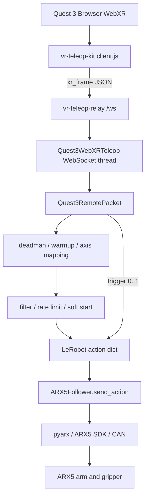

# ARX5 + Quest 3 WebXR Teleoperation

Languages: [English](README.md) | [中文](README-zh.md) | [Français](README-fr.md)

Data-flow guides: [English](README_DETAILED_CHAIN.md) | [中文](README_DETAILED_CHAIN-zh.md) | [Français](README_DETAILED_CHAIN-fr.md)

This is a compact LeRobot-style project for single-arm and bimanual ARX5 teleoperation with a Quest 3 WebXR controller. The single-arm launch command is:

```bash
lerobot-teleoperate \
  --robot.type=arx5_follower \
  --robot.control_mode=cartesian_control \
  --teleop.type=quest3_webxr \
  --teleop.ws_url=ws://127.0.0.1:8443/ws
```

The browser uses the original `vr-teleop-kit` WebXR page and `vr-teleop-relay`; no wrapper is required.

## 1. Project layout

```text
arx5-webxr-teleop/
  src/lerobot/
    robots/arx5_follower/
    robots/bi_arx5/
    teleoperators/quest3_webxr/
    teleoperators/bi_quest3_webxr/
    scripts/lerobot_teleoperate.py
  vr-teleop-kit/
    src/vr_teleop_kit/relay/
  examples/
    arx5_tcp_four_point_calibration.py
    quest3_webxr_tcp_pivot_calibration.py
  third_party/ARX5_SDK/
  environment.yml
  pyproject.toml
```

The `src/lerobot` package keeps LeRobot's configuration and CLI conventions. The WebXR teleoperators implement frame reception, Quest-to-ARX5 TCP mapping, filtering, rate limiting, warm-up, and continuous gripper control.

## 2. Environment setup

The original development paths are:

```text
/home/jiang-yifeng/桌面/quest_arx_web/arx5-webxr-teleop
/home/jiang-yifeng/miniforge3/envs/arx5-webxr-teleop
```

### 2.1 Create the environment from scratch

Create the environment with mamba:

```bash
cd /home/jiang-yifeng/桌面/quest_arx_web/arx5-webxr-teleop
mamba env create -f environment.yml
mamba activate arx5-webxr-teleop
python -m pip install -e .
python -m pip install -e ./vr-teleop-kit
python -m pip install -e ./third_party/ARX5_SDK --no-build-isolation --no-deps
```

### 2.2 Add missing dependencies to an existing environment

If an earlier `--no-deps` installation omitted the base dependencies, repair it with:

```bash
mamba activate arx5-webxr-teleop
cd /home/jiang-yifeng/桌面/quest_arx_web/arx5-webxr-teleop
python -m pip install fastapi uvicorn[standard] draccus websockets huggingface-hub spdlog termcolor
python -m pip install -e .
python -m pip install -e ./vr-teleop-kit
```

WebRTC video is optional. Install `av aiortc opencv-python-headless` only when a camera stream is needed. Verify that imports resolve to this checkout:

```bash
python - <<'PY'
import lerobot, vr_teleop_kit, pyarx
print("lerobot:", lerobot.__file__)
print("vr_teleop_kit:", vr_teleop_kit.__file__)
print("pyarx:", pyarx.__file__)
PY
```

## 3. Start the WebXR relay

On the PC:

```bash
mamba activate arx5-webxr-teleop
vr-teleop-relay --host 127.0.0.1 --port 8443
```

For USB debugging, use another terminal:

```bash
adb reverse tcp:8443 tcp:8443
```

If ADB reports insufficient permissions, install Android udev rules, reload udev, restart ADB, reconnect the Quest, and accept USB debugging in the headset:

```bash
sudo apt update
sudo apt install android-sdk-platform-tools-common
sudo udevadm control --reload-rules
sudo udevadm trigger
adb kill-server
adb start-server
adb devices
adb reverse tcp:8443 tcp:8443
```

If required, add a rule for the usual Quest/Meta vendor ID `2833`:

```bash
echo 'SUBSYSTEM=="usb", ATTR{idVendor}=="2833", MODE="0666", GROUP="plugdev", TAG+="uaccess"' | sudo tee /etc/udev/rules.d/51-android-quest.rules
sudo udevadm control --reload-rules
sudo udevadm trigger
adb kill-server
adb start-server
```

Open `http://localhost:8443/` in the Quest 3 browser and click `Start Teleop`. The relay serves the page and broadcasts WebSocket messages at `ws://127.0.0.1:8443/ws`.

## 4. Start teleoperation

Run a dry run first:

```bash
mamba activate arx5-webxr-teleop
lerobot-teleoperate \
  --robot.type=arx5_follower \
  --robot.control_mode=cartesian_control \
  --teleop.type=quest3_webxr \
  --teleop.ws_url=ws://127.0.0.1:8443/ws \
  --fps=30 \
  --teleop.pos_sensitivity=0.5 \
  --teleop.max_pos_velocity=1.0 \
  --teleop.max_rot_velocity=0.8 \
  --teleop.control_orientation=False \
  --dryrun=True
```

For real hardware, omit `--dryrun=True` and optionally use `--teleop.control_orientation=True`. A smooth return-to-home can be configured with `--robot.home_move_duration_s=6.0`.

Bimanual dry run and hardware use `--robot.type=bi_arx5`, `--teleop.type=bi_quest3_webxr`, `--robot.enable_tactile_sensors=false`, and `--robot.cameras='{}'`. The defaults are `left_arm_port=can1`, `right_arm_port=can3`, both grippers open at `1.57`, and `robot.gripper_vel_max=20.0`.

## 5. Calibration

Calibrate the Quest virtual TCP:

```bash
python examples/quest3_webxr_tcp_pivot_calibration.py \
  --ws-url ws://127.0.0.1:8443/ws \
  --hand right \
  --samples 6 \
  --output quest3_webxr_tcp_calibration.json
```

Calibrate the physical ARX5 TCP:

```bash
python examples/arx5_tcp_four_point_calibration.py \
  --model X5 \
  --interface can3 \
  --samples 4 \
  --output tcp_calibration_arx5.json
```

Pass the resulting offsets with `--teleop.controller_tcp_offset_xyz="[...]"` and `--robot.tcp_offset_xyz="[...]"`; bimanual operation accepts separate left and right offsets.

## 6. Complete control chain



### 6.1 Quest browser

The WebXR client reads controller position, quaternion, and gamepad buttons. The right grip is the TCP deadman, the trigger continuously controls the gripper, and the reset button requests a return to the initial pose.

### 6.2 Relay

`vr-teleop-relay` serves the WebXR page and broadcasts `/ws` messages. It does not perform IK, coordinate mapping, or direct robot control.

### 6.3 WebXR teleoperator

The teleoperator keeps only the latest frame, converts WebXR `xyzw` quaternions to internal `wxyz`, performs warm-up, captures the reference pose, and emits a LeRobot action. Releasing the grip freezes the TCP target; gripper trigger updates remain independent.

### 6.4 Coordinate mapping

WebXR uses X right, Y up, and Z toward the operator. ARX5 uses X forward, Y left, and Z up. World-space position and orientation deltas are mapped through `controller_world_to_robot_axes`, then filtered and rate-limited.

### 6.5 ARX5 control

`ARX5Follower.send_action()` converts `tcp.x/y/z`, `tcp.r1..r6`, and `gripper.pos` to an ARX5 SDK `EEFState` and sends it over CAN. Keep `--teleop.control_orientation=False` while validating translation axes. MIT gripper tuning is available with `--robot.gripper_control_mode=mit`, `--robot.gripper_mit_kp=0.8`, `--robot.gripper_mit_kd=0.05`, and `--robot.gripper_over_current_cnt_max=120`.

## 7. Verification

```bash
mamba activate arx5-webxr-teleop
lerobot-teleoperate --help
```

The help output should list `arx5_follower`, `bi_arx5`, `quest3_webxr`, and `bi_quest3_webxr`. Do not put a space after the equals sign in CLI options, for example `--teleop.pos_sensitivity=0.5`.

For the engineering-level data flow and debugging record, see [`README_DETAILED_CHAIN.md`](README_DETAILED_CHAIN.md).
