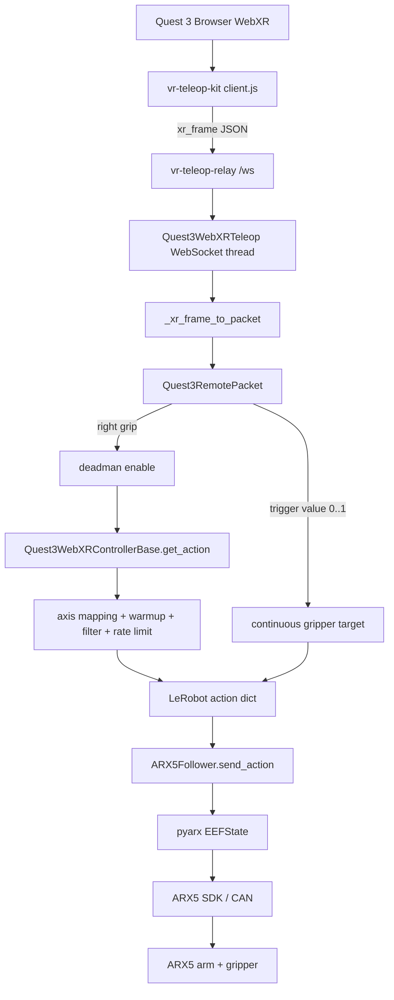

# ARX5 + Quest 3 WebXR Teleoperation

这是一个精简后的 LeRobot 风格项目，只保留单臂 ARX5 和 Quest 3 WebXR 遥操作链路。启动方式保持为：

```bash
lerobot-teleoperate \
  --robot.type=arx5_follower \
  --robot.control_mode=cartesian_control \
  --teleop.type=quest3_webxr \
  --teleop.ws_url=ws://127.0.0.1:8443/ws
```

网页端继续使用 `vr-teleop-kit` 原始 WebXR 页面和 `vr-teleop-relay`，没有额外 wrapper。

## 1. 项目结构

```text
arx5-webxr-teleop/
  src/lerobot/
    robots/arx5_follower/
    teleoperators/quest3_webxr/
    scripts/lerobot_teleoperate.py
  vr-teleop-kit/
    src/vr_teleop_kit/relay/
  examples/
    arx5_tcp_four_point_calibration.py
    quest3_webxr_tcp_pivot_calibration.py
  third_party/ARX5_SDK/
  environment.yml
  pyproject.toml
```

`src/lerobot` 保留 LeRobot 的包格式和配置解析方式；`quest3_webxr` 内部包含 WebXR 接收、Quest 手柄到 ARX5 TCP 的映射、滤波、限速、warmup、连续夹爪控制等逻辑。

## 2. 环境配置

当前项目路径：

```text
/home/jiang-yifeng/桌面/quest_arx_web/arx5-webxr-teleop
```

当前推荐环境：

```text
/home/jiang-yifeng/miniforge3/envs/arx5-webxr-teleop
```

当前环境中的命令入口：

```text
/home/jiang-yifeng/miniforge3/envs/arx5-webxr-teleop/bin/vr-teleop-relay
/home/jiang-yifeng/miniforge3/envs/arx5-webxr-teleop/bin/lerobot-teleoperate
```

### 2.1 从零创建环境

推荐使用 mamba：

```bash
cd /home/jiang-yifeng/桌面/quest_arx_web/arx5-webxr-teleop
mamba env create -f environment.yml
mamba activate arx5-webxr-teleop
```

安装当前项目和 WebXR relay。这里不要加 `--no-deps`，因为 relay 需要 `fastapi/uvicorn` 才能启动网页和 `/ws`：

```bash
python -m pip install -e .
python -m pip install -e ./vr-teleop-kit
```

安装 ARX5 SDK Python binding：

```bash
python -m pip install -e ./third_party/ARX5_SDK --no-build-isolation --no-deps
```

### 2.2 已有环境补装依赖

如果之前用 `--no-deps` 安装过，可能会缺少 relay 和 LeRobot 基础依赖。按下面方式修复当前环境：

```bash
mamba activate arx5-webxr-teleop
cd /home/jiang-yifeng/桌面/quest_arx_web/arx5-webxr-teleop

python -m pip install fastapi uvicorn[standard] draccus websockets huggingface-hub spdlog termcolor
python -m pip install -e .
python -m pip install -e ./vr-teleop-kit
```

当前 ARX5 控制链路只需要 relay 的网页和 WebSocket，所以 WebRTC 视频依赖是可选的。需要相机视频流时再安装：

```bash
python -m pip install av aiortc opencv-python-headless
```

检查加载路径：

```bash
python - <<'PY'
import lerobot, vr_teleop_kit, pyarx
print("lerobot:", lerobot.__file__)
print("vr_teleop_kit:", vr_teleop_kit.__file__)
print("pyarx:", pyarx.__file__)
PY
```

期望都指向当前仓库目录。

## 3. 启动 WebXR Relay

USB 调试推荐：

```bash
mamba activate arx5-webxr-teleop
vr-teleop-relay --host 127.0.0.1 --port 8443
```

另开终端：

```bash
adb reverse tcp:8443 tcp:8443
```

如果出现：

```text
adb: error: insufficient permissions for device: missing udev rules? user is in the plugdev group
```

说明 Linux 当前用户还没有 Quest USB 设备访问权限，`adb reverse` 没有真正连上设备。按下面顺序修复。

先试 Ubuntu 自带 Android udev 规则：

```bash
sudo apt update
sudo apt install android-sdk-platform-tools-common
sudo udevadm control --reload-rules
sudo udevadm trigger
adb kill-server
adb start-server
```

然后拔插 Quest USB，在头显里允许 USB debugging，再检查：

```bash
adb devices
adb reverse tcp:8443 tcp:8443
```

如果还不行，手动添加 Quest/Meta udev 规则。先查看 USB vendor id：

```bash
lsusb
```

Quest/Meta 通常是 `2833`。添加规则：

```bash
echo 'SUBSYSTEM=="usb", ATTR{idVendor}=="2833", MODE="0666", GROUP="plugdev", TAG+="uaccess"' | sudo tee /etc/udev/rules.d/51-android-quest.rules

sudo udevadm control --reload-rules
sudo udevadm trigger
adb kill-server
adb start-server
```

再次拔插 Quest USB，并在头显里允许调试：

```bash
adb devices
```

正常应看到：

```text
xxxxxxxx    device
```

如果显示 `unauthorized`，到 Quest 里确认 RSA 调试弹窗；如果没有弹窗，可以关开开发者模式，或换 USB 线/接口。成功后再运行：

```bash
adb reverse tcp:8443 tcp:8443
```

Quest 3 浏览器打开：

```text
http://localhost:8443/
```

进入页面后点击 `Start Teleop`。relay 提供网页和 `/ws` WebSocket，机器人控制进程会连接：

```text
ws://127.0.0.1:8443/ws
```

## 4. 启动 Teleoperate

先 dryrun：

```bash
mamba activate arx5-webxr-teleop

lerobot-teleoperate \
  --robot.type=arx5_follower \
  --robot.control_mode=cartesian_control \
  --teleop.type=quest3_webxr \
  --teleop.ws_url=ws://127.0.0.1:8443/ws \
  --fps=30 \
  --teleop.pos_sensitivity=0.5 \
  --teleop.max_pos_velocity=1.0 \
  --teleop.max_rot_velocity=0.8 \
  --teleop.control_orientation=False \
  --dryrun=True
```

真机控制 xyz：

```bash
lerobot-teleoperate \
  --robot.type=arx5_follower \
  --robot.control_mode=cartesian_control \
  --teleop.type=quest3_webxr \
  --teleop.ws_url=ws://127.0.0.1:8443/ws \
  --fps=30 \
  --teleop.pos_sensitivity=0.5 \
  --teleop.max_pos_velocity=1.0 \
  --teleop.max_rot_velocity=0.8 \
  --teleop.control_orientation=False \
  --robot.home_move_duration_s=6.0
```

真机控制 xyz + 姿态：

```bash
lerobot-teleoperate \
  --robot.type=arx5_follower \
  --robot.control_mode=cartesian_control \
  --teleop.type=quest3_webxr \
  --teleop.ws_url=ws://127.0.0.1:8443/ws \
  --fps=30 \
  --teleop.pos_sensitivity=0.5 \
  --teleop.max_pos_velocity=1.0 \
  --teleop.control_orientation=True \
  --teleop.max_rot_velocity=0.8 \
  --robot.home_move_duration_s=6.0
```

## 5. 标定

Quest 3 手柄虚拟 TCP 标定：

```bash
python examples/quest3_webxr_tcp_pivot_calibration.py \
  --ws-url ws://127.0.0.1:8443/ws \
  --hand right \
  --samples 6 \
  --output quest3_webxr_tcp_calibration.json
```

ARX5 真实 TCP 标定：

```bash
python examples/arx5_tcp_four_point_calibration.py \
  --model X5 \
  --interface can3 \
  --samples 4 \
  --output tcp_calibration_arx5.json
```

临时使用两份标定：

```bash
lerobot-teleoperate \
  --robot.type=arx5_follower \
  --robot.control_mode=cartesian_control \
  --teleop.type=quest3_webxr \
  --teleop.ws_url=ws://127.0.0.1:8443/ws \
  --teleop.controller_tcp_offset_xyz="[-0.014441,-0.021764,-0.098030]" \
  --robot.tcp_offset_xyz="[0.032896,0.002644,-0.006774]" \
  --fps=30
```

## 6. 完整链路



### 6.1 Quest 浏览器

`vr-teleop-kit/src/vr_teleop_kit/relay/web/client.js` 在 WebXR session 中读取右手柄：

```json
{
  "type": "xr_frame",
  "controllers": {
    "right": {
      "position": [x, y, z],
      "orientation": [qx, qy, qz, qw],
      "buttons": [
        {"p": false, "v": 0.0},
        {"p": true, "v": 1.0}
      ]
    }
  }
}
```

右 grip 是 deadman enable；trigger 的 `v` 是连续值，用来控制夹爪开合程度。

### 6.2 Relay

`vr-teleop-relay` 只负责提供页面和广播 WebSocket 消息。它不做 IK、不做坐标映射、不直接控制机器人。

### 6.3 WebXR Teleoperator

`Quest3WebXRTeleop` 后台线程连接 `/ws`，只保留最新一帧 `xr_frame`。每次 LeRobot 控制循环调用 `get_action()` 时，最新 WebXR 帧会被转换成内部 packet：

```text
position -> controller position
orientation xyzw -> quaternion wxyz
grip button -> deadman enable
trigger value -> gripper.pos
reset button -> reset request
```

### 6.4 坐标映射

WebXR world：

```text
X right
Y up
Z toward operator
```

ARX5 robot world：

```text
X forward
Y left
Z up
```

默认映射在 `Quest3WebXRConfig` 中：

```python
controller_world_to_robot_axes = [
    [1.0, 0.0, 0.0],
    [0.0, 0.0, -1.0],
    [0.0, 1.0, 0.0],
]
```

WebXR 版本默认使用 world 平移和 world 姿态 delta：

```text
controller_translation_source = "world"
controller_rotation_source = "world"
```

这样手柄向上、向前、左右移动时，会先在 WebXR 世界坐标中取 delta，再映射到 ARX5 世界坐标。

### 6.5 ARX5 控制

`Quest3WebXRControllerBase.get_action()` 输出 LeRobot action：

```python
{
    "tcp.x": ...,
    "tcp.y": ...,
    "tcp.z": ...,
    "tcp.r1": ...,
    "tcp.r2": ...,
    "tcp.r3": ...,
    "tcp.r4": ...,
    "tcp.r5": ...,
    "tcp.r6": ...,
    "gripper.pos": ...,
}
```

`ARX5Follower.send_action()` 将 action 转为 ARX5 SDK 的 `EEFState`，通过 `pyarx` 发送给 CAN 控制器。退出时使用平滑回 home：

```bash
--robot.home_move_duration_s=6.0
```

## 7. 验证

```bash
mamba activate arx5-webxr-teleop
lerobot-teleoperate --help
```

应看到：

```text
--robot.type {arx5_follower}
--teleop.type {quest3_webxr}
```

命令行参数等号后不要加空格：

```bash
--teleop.pos_sensitivity=0.5
```
