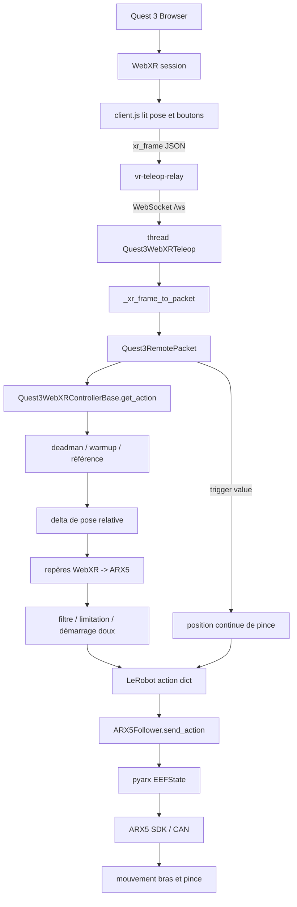

# ARX5 + Quest 3 WebXR : flux détaillé des données

Langues : [English](README_DETAILED_CHAIN.md) | [中文](README_DETAILED_CHAIN-zh.md) | [Français](README_DETAILED_CHAIN-fr.md)

README principal : [English](README.md) | [中文](README-zh.md) | [Français](README-fr.md)

Ce document explique comment les données du contrôleur Quest 3 deviennent des commandes TCP et pince ARX5. Pour l’installation et l’utilisation, voir [`README-fr.md`](README-fr.md).

## 1. Composants du système

```text
Quest 3 Browser
  -> vr-teleop-kit WebXR page
  -> vr-teleop-relay /ws
  -> Quest3WebXRTeleop
  -> Quest3WebXRControllerBase
  -> LeRobot action dict
  -> ARX5Follower
  -> pyarx / ARX5 SDK
  -> CAN
  -> ARX5 arm + gripper
```

Fichiers principaux : `vr-teleop-kit/src/vr_teleop_kit/relay/web/client.js`, `vr-teleop-kit/src/vr_teleop_kit/relay/server.py`, `src/lerobot/teleoperators/quest3_webxr/teleop_quest3_webxr.py`, `src/lerobot/teleoperators/quest3_webxr/shared_controller.py` et `src/lerobot/robots/arx5_follower/arx5_follower.py`.

## 2. Vue d’ensemble du flux de données



## 3. Étape 1 : acquisition des données VR par le navigateur Quest

Après `Start Teleop`, `client.js` lit le contrôleur droit à chaque trame et envoie le JSON suivant :

```json
{
  "type": "xr_frame",
  "controllers": {
    "right": {
      "position": [x, y, z],
      "orientation": [qx, qy, qz, qw],
      "buttons": [
        {"p": false, "v": 0.0},
        {"p": true, "v": 1.0}
      ]
    }
  }
}
```

Le projet utilise le contrôleur droit : `buttons[1]` est le deadman grip, `buttons[0].v` est le trigger continu de la pince et `buttons[4]` demande le reset. Les axes WebXR sont X droite, Y haut et Z vers l’opérateur. L’ordre du quaternion transmis est `xyzw`.

## 4. Étape 2 : transmission des données VR à l’hôte par le relais

`vr-teleop-relay` fournit la page et diffuse les messages sur `/ws`; il ne fait ni IK, ni commande robot, ni conversion de repères. Avec le débogage USB, `adb reverse tcp:8443 tcp:8443` dirige l’adresse `http://localhost:8443/` du navigateur Quest vers le relais du PC. La vidéo WebRTC reste optionnelle.

## 5. Étape 3 : réception des trames WebXR par l’hôte

`Quest3WebXRTeleop.connect()` lit la pose TCP actuelle, démarre un thread WebSocket et ne conserve que la dernière trame afin de réduire la latence. `get_action()` traite ensuite cette dernière trame à chaque cycle de commande.

## 6. Étape 4 : conversion d’une trame WebXR en packet interne

`_xr_frame_to_packet` mappe la position vers `packet.position`, réordonne l’orientation `[qx,qy,qz,qw]` en `[qw,qx,qy,qz]`, mappe `buttons[1]` vers `grip_pressed`, `buttons[0].v` vers `trigger_value` et `buttons[4]` vers la demande de reset.

## 7. Étape 5 : nécessité du grip deadman et du warm-up

Maintenir le grip autorise le suivi TCP ; le relâcher fige la cible. À l’activation, le contrôleur collecte des échantillons stables puis mémorise `controller_init_H` et `controller_delta_reference_H`. Les réglages importants sont `enable_warmup_s`, `enable_stable_samples`, `enable_stable_pos_threshold_m`, `enable_stable_rot_threshold_deg`, `enable_soft_start_s` et `position_jump_threshold_m`.

## 8. Étape 6 : conversion de la pose du contrôleur en cible TCP ARX5

Les poses utilisent `H = [R t; 0 1]`. Le delta local est :

```text
controller_delta_raw = inv(controller_init_H) @ current_H
```

Le déplacement utilise par défaut le delta dans le monde :

```text
controller_world_delta_raw = current_H.position - controller_init_H.position
```

## 9. Étape 7 : conversion du repère WebXR vers le repère ARX5

Les axes WebXR sont X vers la droite, Y vers le haut et Z vers l’opérateur. Les axes monde ARX5 sont X vers l’avant, Y vers la gauche et Z vers le haut. La matrice par défaut est :

```python
controller_world_to_robot_axes = [
    [1.0, 0.0, 0.0],
    [0.0, 0.0, -1.0],
    [0.0, 1.0, 0.0],
]
```

Translation et rotation utilisent les deltas monde (`controller_translation_source = "world"`, `controller_rotation_source = "world"`). L’orientation est activée par `--teleop.control_orientation=True`.

## 10. Étape 8 : filtrage, limitation de vitesse et démarrage doux

La cible passe par `filter_window_size`, `max_pos_velocity`, `max_rot_velocity` et `enable_soft_start_s`. La sensibilité de position met à l’échelle le déplacement depuis la référence ; `--teleop.control_orientation` active ou désactive le suivi d’orientation.

## 11. Étape 9 : contrôle de la pince par le trigger

Le trigger est mappé ainsi :

```text
gripper.pos = gripper_open + trigger * (gripper_closed - gripper_open)
gripper_open = 1.57
gripper_closed = 0.0
```

La pince est indépendante du deadman TCP : le trigger peut donc continuer à mettre à jour sa cible lorsque le grip est relâché.

## 12. Étape 10 : format de l’action LeRobot

Le contrôleur produit les champs `tcp.x/y/z`, `tcp.r1..r6` et `gripper.pos`. Les trois premiers décrivent la position cible, `tcp.r1..r6` l’orientation cible en représentation 6D et `gripper.pos` l’ouverture cible de la pince.

## 13. Étape 11 : envoi de l’action au bras par ARX5Follower

`ARX5Follower.send_action()` convertit le dictionnaire en `arx5.EEFState`, applique l’offset TCP réel et envoie la commande via `pyarx`, le SDK ARX5 et CAN. Il gère aussi la connexion, le retour d’état, les paramètres de pince et le retour progressif à home avec `--robot.home_move_duration_s=6.0`.

## 14. Position des fichiers de calibration dans la chaîne

`--teleop.controller_tcp_offset_xyz="[...]"` transforme la pose Quest en TCP virtuel ; `--robot.tcp_offset_xyz="[...]"` transforme le lien terminal du SDK en TCP physique. La chaîne complète est :

```text
Quest controller pose
  -> controller_tcp_offset_xyz
  -> virtual controller TCP
  -> WebXR world to ARX5 world mapping
  -> LeRobot action
  -> robot.tcp_offset_xyz
  -> ARX5 SDK command
```

## 15. Historique de débogage des algorithmes et de la chaîne

### 15.1 La CLI ne propose pas `quest3_webxr`

Enregistrez la configuration du téléopérateur et vérifiez que `import lerobot` pointe vers ce dépôt.

### 15.2 La fabrique ne prend pas en charge le téléopérateur WebXR

Ajoutez la branche `quest3_webxr` dans `src/lerobot/teleoperators/utils.py` afin de créer `Quest3WebXRTeleop`.

### 15.3 Méthode d’état warm-up manquante

Une erreur `_reset_enable_warmup` indique une intégration incomplète de la machine d’état partagée dans `Quest3WebXRControllerBase`.

### 15.4 XYZ fonctionne mais l’orientation ne suit pas

Activez `--teleop.control_orientation=True`, vérifiez la conversion `xyzw` vers `wxyz` et utilisez une limite sûre comme `--teleop.max_rot_velocity=0.8`.

### 15.5 Espace après `=` dans une option

Utilisez `--teleop.pos_sensitivity=0.5`, et non `--teleop.pos_sensitivity= 0.5`.

### 15.6 Reset ou retour home trop rapide

Augmentez `--robot.home_move_duration_s` ; une valeur plus élevée ralentit le retour.

### 15.7 Surintensité de pince ou impossibilité de rouvrir

Utilisez le mode MIT et réglez `--robot.gripper_mit_kp`, `--robot.gripper_mit_kd` et `--robot.gripper_over_current_cnt_max`. Le trigger doit rester indépendant du deadman.

### 15.8 Contrôle continu de la pince par le trigger

Traitez `GamepadButton.value` comme une valeur continue `0..1` et mappez-la à chaque trame vers `gripper.pos`, sans logique de bascule.

### 15.9 Couplage des mouvements vertical et avant

Gardez `controller_translation_source = "world"` afin de calculer le delta avant que l’orientation initiale du contrôleur puisse coupler les axes.

### 15.10 Débogage du sens des axes

Utilisez `--teleop.debug_controller_tcp_offset=True` et inspectez `world_raw_xyz`, `world_mapped_xyz` et `world_to_robot_axes`.

### 15.11 Le relais ne trouve pas `av`

Conservez `av`, `aiortc` et OpenCV comme dépendances optionnelles afin que la page et `/ws` fonctionnent sans vidéo.

### 15.12 Le relais ne trouve pas `fastapi` ou `uvicorn`

Installez les dépendances de base du relais, puis réinstallez ce projet et `vr-teleop-kit` en mode éditable.

### 15.13 Permissions ADB insuffisantes

Installez les règles udev Android ou ajoutez l’identifiant vendeur Quest/Meta `2833`, rechargez udev, redémarrez ADB, reconnectez le casque et acceptez la clé RSA.

### 15.14 Réduction du dépôt open source

Le dépôt réduit conserve le format de paquet et la CLI LeRobot, les chemins ARX5/WebXR mono-bras et bimanuel, ainsi que les algorithmes validés de repérage, filtrage, limitation, warm-up et contrôle de pince dans les modules partagés.
