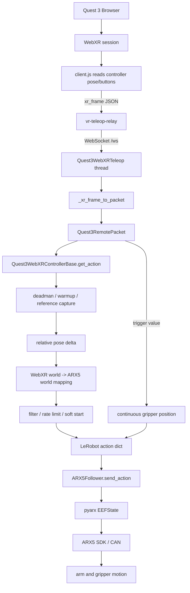

# ARX5 + Quest 3 WebXR Teleoperation: Detailed Data Flow

Languages: [English](README_DETAILED_CHAIN.md) | [中文](README_DETAILED_CHAIN-zh.md) | [Français](README_DETAILED_CHAIN-fr.md)

Main README: [English](README.md) | [中文](README-zh.md) | [Français](README-fr.md)

This document explains how Quest 3 controller data becomes ARX5 TCP and gripper commands. For installation and operation, see [`README.md`](README.md).

## 1. System components

```text
Quest 3 Browser
  -> vr-teleop-kit WebXR page
  -> vr-teleop-relay /ws
  -> Quest3WebXRTeleop
  -> Quest3WebXRControllerBase
  -> LeRobot action dict
  -> ARX5Follower
  -> pyarx / ARX5 SDK
  -> CAN
  -> ARX5 arm + gripper
```

Relevant files are `vr-teleop-kit/src/vr_teleop_kit/relay/web/client.js`, `vr-teleop-kit/src/vr_teleop_kit/relay/server.py`, `src/lerobot/teleoperators/quest3_webxr/teleop_quest3_webxr.py`, `src/lerobot/teleoperators/quest3_webxr/shared_controller.py`, and `src/lerobot/robots/arx5_follower/arx5_follower.py`.

## 2. Data-flow overview



## 3. Step 1: How the Quest browser captures VR data

After `Start Teleop`, `client.js` reads the right controller every frame and sends JSON:

```json
{
  "type": "xr_frame",
  "controllers": {
    "right": {
      "position": [x, y, z],
      "orientation": [qx, qy, qz, qw],
      "buttons": [
        {"p": false, "v": 0.0},
        {"p": true, "v": 1.0}
      ]
    }
  }
}
```

The project uses the right controller: `buttons[1]` is the grip deadman, `buttons[0].v` is the continuous trigger for the gripper, and `buttons[4]` requests reset. WebXR coordinates are X right, Y up, and Z toward the operator. Quaternion order on the wire is `xyzw`.

## 4. Step 2: How the relay sends VR data to the host

`vr-teleop-relay` serves the page and broadcasts messages on `/ws`; it does not perform IK, robot control, or coordinate conversion. With USB debugging, `adb reverse tcp:8443 tcp:8443` makes the Quest browser's `http://localhost:8443/` address reach the relay running on the PC. WebRTC video is optional; the robot-control path requires only the page and WebSocket.

## 5. Step 3: How the host receives WebXR frames

The host command is:

```bash
lerobot-teleoperate \
  --robot.type=arx5_follower \
  --robot.control_mode=cartesian_control \
  --teleop.type=quest3_webxr \
  --teleop.ws_url=ws://127.0.0.1:8443/ws
```

`Quest3WebXRTeleop.connect()` reads the current ARX5 TCP pose, starts a WebSocket thread, and keeps only the newest `xr_frame` to minimize latency. Each control-cycle call to `get_action()` converts that frame to a `Quest3RemotePacket`: position, quaternion (`xyzw` -> `wxyz`), grip state, trigger value, and reset state.

## 6. Step 4: How a WebXR frame becomes an internal packet

For each control cycle, `_xr_frame_to_packet` maps controller position to `packet.position`, reorders orientation from `[qx,qy,qz,qw]` to `[qw,qx,qy,qz]`, maps `buttons[1]` to `grip_pressed`, maps `buttons[0].v` to `trigger_value`, and maps `buttons[4]` to the reset request.

## 7. Step 5: Why grip deadman and warm-up are required

Holding the grip enables TCP following; releasing it freezes the TCP target. When enabled, the controller collects stable samples before motion begins and records `controller_init_H` (controller pose) and `controller_delta_reference_H` (robot target pose). The relevant controls include `enable_warmup_s`, `enable_stable_samples`, `enable_stable_pos_threshold_m`, `enable_stable_rot_threshold_deg`, `enable_soft_start_s`, and `position_jump_threshold_m`.

## 8. Step 6: How controller pose becomes an ARX5 TCP target

Poses use homogeneous transforms `H = [R t; 0 1]`. The raw local delta is:

```text
controller_delta_raw = inv(controller_init_H) @ current_H
```

Translation uses a world-space delta by default:

```text
controller_world_delta_raw = current_H.position - controller_init_H.position
```

## 9. Step 7: How WebXR coordinates map to ARX5 coordinates

WebXR world axes are X right, Y up, and Z toward the operator. ARX5 robot-world axes are X forward, Y left, and Z up. The default WebXR-to-ARX5 axis matrix is:

```python
controller_world_to_robot_axes = [
    [1.0, 0.0, 0.0],
    [0.0, 0.0, -1.0],
    [0.0, 1.0, 0.0],
]
```

Both translation and rotation use world deltas by default (`controller_translation_source = "world"`, `controller_rotation_source = "world"`). Position sensitivity scales the displacement from the base pose. Orientation following is enabled with `--teleop.control_orientation=True`.

## 10. Step 8: Filtering, rate limiting, and soft start

The mapped target passes through the sliding filter (`filter_window_size`), maximum linear and angular velocity limits (`max_pos_velocity`, `max_rot_velocity`), and soft start (`enable_soft_start_s`). Position sensitivity scales displacement from the reference target. Orientation following is controlled by `--teleop.control_orientation`.

## 11. Step 9: How the trigger controls the gripper

Trigger mapping is:

```text
gripper.pos = gripper_open + trigger * (gripper_closed - gripper_open)
gripper_open = 1.57
gripper_closed = 0.0
```

Gripper control is independent of the TCP deadman, so trigger updates may continue while grip is released.

## 12. Step 10: The LeRobot action format

The controller emits:

```python
{
    "tcp.x": ..., "tcp.y": ..., "tcp.z": ...,
    "tcp.r1": ..., "tcp.r2": ..., "tcp.r3": ...,
    "tcp.r4": ..., "tcp.r5": ..., "tcp.r6": ...,
    "gripper.pos": ...,
}
```

`tcp.x/y/z` represent the target position, `tcp.r1..r6` represent the target orientation in the 6D rotation representation, and `gripper.pos` is the gripper opening target.

## 13. Step 11: How ARX5Follower sends the action to the arm

`ARX5Follower.send_action()` converts the action dictionary to `arx5.EEFState`, applies the physical TCP offset, and sends it through `pyarx` to the ARX5 SDK and CAN controller. It also owns SDK connection, feedback reads, gripper-control parameters, and the smooth shutdown home motion configured by `--robot.home_move_duration_s=6.0`.

## 14. Where calibration files enter the chain

`--teleop.controller_tcp_offset_xyz="[...]"` converts the Quest pose to a virtual controller TCP. `--robot.tcp_offset_xyz="[...]"` converts the ARX5 SDK end-effector link to the physical tool TCP. The complete chain is:

```text
Quest controller pose
  -> controller_tcp_offset_xyz
  -> virtual controller TCP
  -> WebXR world to ARX5 world mapping
  -> LeRobot action
  -> robot.tcp_offset_xyz
  -> ARX5 SDK command
```

## 15. Algorithm and control-chain debugging record

### 15.1 The CLI does not list `quest3_webxr`

Register the teleoperator configuration and verify that `import lerobot` points to this checkout rather than another installation.

### 15.2 The factory does not support the WebXR teleoperator

Add the `quest3_webxr` branch in `src/lerobot/teleoperators/utils.py` so the recognized configuration can create `Quest3WebXRTeleop`.

### 15.3 Warm-up state method is missing

Warm-up state belongs in `Quest3WebXRControllerBase`; missing `_reset_enable_warmup` indicates incomplete shared state-machine integration.

### 15.4 XYZ works but orientation does not follow

Use `--teleop.control_orientation=True`, confirm `xyzw` to `wxyz` conversion, and set a safe `--teleop.max_rot_velocity`, such as `0.8`.

### 15.5 A CLI value contains a space after `=`

Use `--teleop.pos_sensitivity=0.5`, not `--teleop.pos_sensitivity= 0.5`.

### 15.6 Reset or home motion is too fast

Increase `--robot.home_move_duration_s`; larger values produce a slower return.

### 15.7 Gripper over-current or failure to reopen

Use MIT mode and tune `--robot.gripper_mit_kp`, `--robot.gripper_mit_kd`, and `--robot.gripper_over_current_cnt_max`. Keep trigger updates independent of grip/deadman state.

### 15.8 Continuous trigger-based gripper control

Treat `GamepadButton.value` as a continuous `0..1` value and map every frame to `gripper.pos` instead of using a toggle.

### 15.9 Vertical and forward motion are coupled

Keep `controller_translation_source = "world"` so the position delta is computed before the initial controller orientation can couple the axes.

### 15.10 Coordinate-axis direction debugging

Use `--teleop.debug_controller_tcp_offset=True` and inspect `world_raw_xyz`, `world_mapped_xyz`, and `world_to_robot_axes`.

### 15.11 The relay cannot import `av`

Keep `av`, `aiortc`, and OpenCV optional so missing video dependencies do not prevent the page and `/ws` control channel from starting.

### 15.12 The relay cannot import `fastapi` or `uvicorn`

Install the base relay dependencies, then reinstall this project and `vr-teleop-kit` in editable mode.

### 15.13 ADB permission failure

Install Android udev rules or add the Quest/Meta vendor ID `2833`, reload udev, restart ADB, reconnect the headset, and accept its RSA prompt.

### 15.14 Open-source repository reduction

The reduced repository keeps the LeRobot package/CLI format, the single-arm and bimanual ARX5/WebXR paths, and the verified mapping, filtering, rate-limiting, warm-up, and gripper logic in the shared controller modules.
