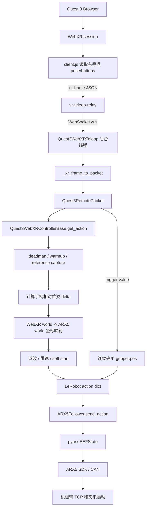

# ARX5 + Quest 3 WebXR Teleoperation: Detailed Data Flow

这份文档面向第一次接触本项目的人，重点解释一件事：

```text
Quest 3 手柄数据如何一步步变成 ARX5 机械臂 TCP 和夹爪的运动命令
```

如果只想安装和运行，请先看 `README.md`。本文更偏工程链路说明和调试记录。

## 1. 系统由哪些部分组成

```text
Quest 3 Browser
  -> vr-teleop-kit WebXR page
  -> vr-teleop-relay /ws
  -> Quest3WebXRTeleop
  -> Quest3WebXRControllerBase
  -> LeRobot action dict
  -> ARX5Follower
  -> pyarx / ARX5 SDK
  -> CAN
  -> ARX5 arm + gripper
```

对应代码位置：

```text
vr-teleop-kit/src/vr_teleop_kit/relay/web/client.js
vr-teleop-kit/src/vr_teleop_kit/relay/server.py
src/lerobot/teleoperators/quest3_webxr/teleop_quest3_webxr.py
src/lerobot/teleoperators/quest3_webxr/shared_controller.py
src/lerobot/robots/arx5_follower/arx5_follower.py
```

## 2. 数据流总览



## 3. 第一步：Quest 浏览器如何采集 VR 数据

Quest 3 使用浏览器打开：

```text
http://localhost:8443/
```

点击页面中的 `Start Teleop` 后，浏览器进入 WebXR session。网页中的 `client.js` 每帧读取右手柄数据，包括：

- 手柄位置 `position`
- 手柄姿态 `orientation`
- 按钮按下状态 `buttons[i].p`
- 按钮连续值 `buttons[i].v`

发送的数据格式是 JSON：

```json
{
  "type": "xr_frame",
  "controllers": {
    "right": {
      "position": [x, y, z],
      "orientation": [qx, qy, qz, qw],
      "buttons": [
        {"p": false, "v": 0.0},
        {"p": true, "v": 1.0}
      ]
    }
  }
}
```

本项目只使用右手柄：

- `position`：WebXR world 坐标下的右手柄位置。
- `orientation`：WebXR 四元数，顺序是 `xyzw`。
- `buttons[1]`：右 grip，作为 deadman enable。
- `buttons[0].v`：右 trigger 连续值，用于控制夹爪开合程度。
- `buttons[4]`：reset 按键，用于触发回起始位姿。

WebXR world 坐标约定：

```text
X: right
Y: up
Z: toward operator
```

## 4. 第二步：relay 如何把 VR 数据发给上位机

`vr-teleop-relay` 是一个 FastAPI 服务，提供两件事：

- 静态网页：Quest 浏览器打开的 WebXR 页面。
- WebSocket：`/ws`，用于广播 `xr_frame` 等消息。

USB 调试时，PC 上启动：

```bash
vr-teleop-relay --host 127.0.0.1 --port 8443
```

再执行：

```bash
adb reverse tcp:8443 tcp:8443
```

这样 Quest 浏览器访问 `http://localhost:8443/` 时，实际访问的是 PC 上的 relay。

relay 不做机器人控制，不做坐标变换，也不做 IK。它只负责广播：

```text
Quest browser -- xr_frame JSON --> relay -- /ws broadcast --> teleop process
```

WebRTC 视频是可选功能。ARX5 控制链路只需要网页和 WebSocket，所以缺少 `av/aiortc` 时 relay 仍然可以启动。

## 5. 第三步：上位机如何接收 WebXR 帧

上位机使用：

```bash
lerobot-teleoperate \
  --robot.type=arx5_follower \
  --robot.control_mode=cartesian_control \
  --teleop.type=quest3_webxr \
  --teleop.ws_url=ws://127.0.0.1:8443/ws
```

`lerobot-teleoperate` 做三件事：

1. 根据 `--robot.type=arx5_follower` 创建 ARX5 机器人对象。
2. 根据 `--teleop.type=quest3_webxr` 创建 WebXR teleoperator。
3. 进入固定频率控制循环：读取 teleop action，然后发送给 robot。

`Quest3WebXRTeleop.connect()` 会：

```text
读取当前 ARX5 TCP 位姿
  -> 作为初始目标位姿
  -> 启动 WebSocket 后台线程
  -> 连接 ws://127.0.0.1:8443/ws
  -> 持续接收 xr_frame
  -> 只保存最新一帧
```

只保存最新一帧是为了降低遥操作延迟。机器人控制不需要旧帧，旧帧只会让机械臂“追过去的手”。

## 6. 第四步：WebXR 帧如何转成内部 packet

每次控制循环调用：

```python
teleop.get_action()
```

`Quest3WebXRTeleop` 会把最新 `xr_frame` 转成 `Quest3RemotePacket`：

```text
position -> packet.position
orientation [qx,qy,qz,qw] -> packet.quaternion_wxyz [qw,qx,qy,qz]
buttons[1] -> grip_pressed
buttons[0].v -> trigger_value
buttons[4] -> a_pressed / reset request
```

WebXR 的四元数顺序是 `xyzw`，而控制代码内部使用 `wxyz`，所以这里必须重排。

## 7. 第五步：为什么需要 grip deadman 和 warmup

右 grip 是 deadman enable：

```text
按住 grip   -> 允许 TCP 位姿跟随手柄
松开 grip   -> TCP 目标保持，不再跟随手柄
```

这样可以避免：

- 手柄离开追踪区域后机械臂继续漂移。
- 手柄放下或调整握姿时机械臂误动。
- WebXR 刚启动时缓存帧或跳变帧直接进入机械臂。

按下 grip 后，系统会先做短暂 warmup：

```text
收集若干帧
检查位置跨度和姿态跨度
稳定后记录参考位姿
开始正式控制
```

相关参数：

```text
enable_warmup_s
enable_stable_samples
enable_stable_pos_threshold_m
enable_stable_rot_threshold_deg
enable_soft_start_s
position_jump_threshold_m
```

warmup 时间不能太长，否则手感会卡；也不能完全没有，否则 Quest 首帧跳变可能打到机械臂。

## 8. 第六步：手柄位姿如何变成 ARX5 TCP 目标

核心代码：

```text
src/lerobot/teleoperators/quest3_webxr/shared_controller.py
```

系统使用齐次变换矩阵表示手柄和机器人 TCP：

```text
H = [R t]
    [0 1]
```

当 grip 通过 warmup 后，记录：

```text
controller_init_H
controller_delta_reference_H
```

含义：

- `controller_init_H`：启用瞬间的手柄虚拟 TCP 位姿。
- `controller_delta_reference_H`：启用瞬间的机器人 TCP 目标位姿。

之后每帧读取当前手柄位姿：

```text
current_H
```

局部相对变化：

```text
controller_delta_raw = inv(controller_init_H) @ current_H
```

WebXR 平移默认使用 world delta：

```text
controller_world_delta_raw = current_H.position - controller_init_H.position
```

这样可以避免手柄初始姿态把“向上移动”耦合成“向上 + 向前”。

## 9. 第七步：WebXR 坐标如何映射到 ARX5 坐标

WebXR world：

```text
X: right
Y: up
Z: toward operator
```

ARX5 robot world：

```text
X: forward
Y: left
Z: up
```

默认映射在 `Quest3WebXRConfig`：

```python
controller_world_to_robot_axes = [
    [1.0, 0.0, 0.0],
    [0.0, 0.0, -1.0],
    [0.0, 1.0, 0.0],
]
```

WebXR 版本默认：

```text
controller_translation_source = "world"
controller_rotation_source = "world"
```

平移和姿态 delta 都先在 WebXR world 里计算，再映射到 ARX5 world。

## 10. 第八步：滤波、限速和 soft start

映射完成后得到未处理目标：

```text
target_H_unscaled
```

位置灵敏度：

```text
target_pos = base_pos + (target_pos_unscaled - base_pos) * pos_sensitivity
```

姿态是否跟随由参数决定：

```bash
--teleop.control_orientation=False
```

只控制 `tcp.x/y/z`。

```bash
--teleop.control_orientation=True
```

同时控制 `tcp.x/y/z` 和 TCP 姿态。

随后经过：

- `filter_window_size`：滑动滤波，降低抖动。
- `max_pos_velocity`：限制 TCP 最大线速度。
- `max_rot_velocity`：限制 TCP 最大角速度。
- `enable_soft_start_s`：启用瞬间逐渐放大控制量。

## 11. 第九步：trigger 如何控制夹爪

WebXR trigger 提供连续值：

```text
0.0 -> 未扣下
1.0 -> 完全扣下
```

映射方式：

```text
gripper.pos = gripper_open + trigger * (gripper_closed - gripper_open)
```

当前默认：

```text
gripper_open   = 1.57
gripper_closed = 0.0
```

夹爪控制和 grip/deadman 解耦：

- grip 控制 TCP 是否跟随。
- trigger 控制夹爪开合。
- 即使松开 grip，也可以继续通过 trigger 更新夹爪目标。

## 12. 第十步：LeRobot action 长什么样

`Quest3WebXRControllerBase.get_action()` 输出：

```python
{
    "tcp.x": ...,
    "tcp.y": ...,
    "tcp.z": ...,
    "tcp.r1": ...,
    "tcp.r2": ...,
    "tcp.r3": ...,
    "tcp.r4": ...,
    "tcp.r5": ...,
    "tcp.r6": ...,
    "gripper.pos": ...,
}
```

其中：

- `tcp.x/y/z`：目标 TCP 位置。
- `tcp.r1..r6`：目标 TCP 姿态的 6D rotation 表达。
- `gripper.pos`：夹爪目标开合位置。

## 13. 第十一步：ARX5Follower 如何把 action 发给机械臂

核心代码：

```text
src/lerobot/robots/arx5_follower/arx5_follower.py
```

运行模式：

```bash
--robot.control_mode=cartesian_control
```

发送链路：

```text
LeRobot action dict
  -> ARX5Follower.send_action()
  -> arx5.EEFState(...)
  -> arm.set_eef_cmd(...)
  -> ARX5 SDK controller
  -> CAN
  -> ARX5 arm
```

`ARX5Follower` 还负责：

- 连接 ARX5 SDK。
- 读取当前 TCP pose。
- 应用真实 TCP offset。
- 设置夹爪 MIT/position 控制参数。
- 退出时平滑回 home。

回 home 速度：

```bash
--robot.home_move_duration_s=6.0
```

数值越大，回 home 越慢。

## 14. 标定文件在链路中的位置

本项目有两种 TCP 标定。

Quest 手柄虚拟 TCP：

```text
quest3_webxr_tcp_calibration.json
```

作用于：

```text
WebXR controller pose -> controller virtual TCP
```

命令参数：

```bash
--teleop.controller_tcp_offset_xyz="[...]"
```

ARX5 真实 TCP：

```text
tcp_calibration_arx5.json
```

作用于：

```text
ARX5 SDK eef_link -> real tool TCP
```

命令参数：

```bash
--robot.tcp_offset_xyz="[...]"
```

完整位置：

```text
Quest controller pose
  -> controller_tcp_offset_xyz
  -> virtual controller TCP
  -> WebXR world to ARX5 world mapping
  -> LeRobot action
  -> robot.tcp_offset_xyz
  -> ARX5 SDK command
```

## 15. 本次开发中的算法和链路 Debug 记录

### 15.1 CLI 中找不到 `quest3_webxr`

现象：

```text
invalid choice: 'quest3_webxr'
```

原因：

WebXR teleoperator 配置没有注册到 LeRobot choice registry，或者当前环境加载的不是本项目源码。

解决：

- 使用 `@TeleoperatorConfig.register_subclass("quest3_webxr")` 注册配置。
- 确认 `python -c "import lerobot; print(lerobot.__file__)"` 指向当前仓库。

### 15.2 工厂函数不支持 WebXR teleop

现象：

```text
Unsupported teleoperator type: 'quest3_webxr'
```

原因：

配置已经被 argparse 识别，但 `make_teleoperator_from_config()` 没有创建 WebXR teleop 的分支。

解决：

在 `src/lerobot/teleoperators/utils.py` 中只保留 WebXR 分支：

```python
if config.type == "quest3_webxr":
    return Quest3WebXRTeleop(config)
```

### 15.3 warmup 状态方法缺失

现象：

```text
AttributeError: object has no attribute '_reset_enable_warmup'
```

原因：

WebXR 接收层复用了控制状态机，但 warmup 状态管理没有同步到共享基类。

解决：

将 warmup、滤波、限速、参考位姿管理放进：

```text
Quest3WebXRControllerBase
```

### 15.4 xyz 正常但姿态不跟手

现象：

机械臂位置跟随正常，但旋转手柄时 TCP 姿态不变。

原因：

`control_orientation` 可以关闭，用于先安全验证平移轴。

解决：

```bash
--teleop.control_orientation=True
--teleop.max_rot_velocity=0.8
```

同时确认 WebXR 四元数 `xyzw` 已转换为内部 `wxyz`。

### 15.5 参数等号后有空格

错误写法：

```bash
--teleop.pos_sensitivity= 0.5
```

会导致：

```text
unrecognized arguments: 0.5
```

正确写法：

```bash
--teleop.pos_sensitivity=0.5
```

或：

```bash
--teleop.pos_sensitivity 0.5
```

### 15.6 reset/home 太快

现象：

退出或 reset 回 home 速度太快。

解决：

使用平滑回 home，并暴露参数：

```bash
--robot.home_move_duration_s=6.0
```

### 15.7 夹爪 over current 或夹住后松不开

现象：

夹爪夹到物体后报 over current，或夹住后不容易松开。

原因：

位置控制过硬，且早期逻辑可能让 trigger 受 grip/deadman 限制。

解决：

- 增加夹爪 MIT 控制参数：

```bash
--robot.gripper_control_mode=mit
--robot.gripper_mit_kp=0.8
--robot.gripper_mit_kd=0.05
--robot.gripper_over_current_cnt_max=120
```

- trigger 连续控制和 grip/deadman 解耦。
- trigger 每帧映射到 `gripper.pos`。

### 15.8 trigger 连续夹爪控制

判断：

WebXR `GamepadButton.value` 是 `0..1` 连续值。

解决：

```text
trigger = 0.0 -> gripper_open
trigger = 1.0 -> gripper_closed
```

不再把 trigger 当成简单 toggle。

### 15.9 上下和前后耦合

现象：

手柄垂直向上时，机械臂同时向上和向前。

排查：

- `control_orientation=False` 仍存在，说明不是姿态控制造成。
- `controller_tcp_offset_xyz="[0,0,0]"` 仍存在，说明不是单纯 TCP offset。
- 重点转向平移 delta 的参考系。

解决：

WebXR 使用 world 平移：

```text
controller_translation_source = "world"
```

先在 WebXR world 中取位置差，再映射到 ARX5 world。

### 15.10 坐标轴方向调试

现象：

左右或前后方向反。

调试方式：

```bash
--teleop.debug_controller_tcp_offset=True
```

观察：

```text
world_raw_xyz
world_mapped_xyz
world_to_robot_axes
```

最终使用：

```python
controller_world_to_robot_axes = [
    [1.0, 0.0, 0.0],
    [0.0, 0.0, -1.0],
    [0.0, 1.0, 0.0],
]
```

### 15.11 relay 缺少 `av`

现象：

```text
ModuleNotFoundError: No module named 'av'
```

原因：

relay 原始实现顶层导入 WebRTC 视频依赖，即使只使用 WebSocket 控制也会失败。

解决：

将 `av/aiortc/opencv` 改成可选依赖。缺少视频依赖时：

- 网页仍能启动。
- `/ws` 仍能传输 WebXR 控制数据。
- 只有请求 WebRTC 视频时才提示缺依赖。

### 15.12 relay 缺少 `fastapi/uvicorn`

现象：

```text
ModuleNotFoundError: No module named 'fastapi'
```

原因：

之前用 `--no-deps` 安装，跳过了 relay 的基础 Web 服务依赖。

解决：

```bash
python -m pip install fastapi uvicorn[standard] draccus websockets huggingface-hub spdlog termcolor
python -m pip install -e .
python -m pip install -e ./vr-teleop-kit
```

### 15.13 ADB 权限不足

现象：

```text
adb: error: insufficient permissions for device
```

原因：

Linux 当前用户没有 Quest USB 设备访问权限，`adb reverse` 未建立。

解决：

- 安装 `android-sdk-platform-tools-common`。
- 或添加 vendor id `2833` 的 udev rule。
- 重载 udev、重启 adb server、拔插 Quest，并在头显里允许 USB debugging。

### 15.14 开源仓库精简

目标：

保留 LeRobot 文件格式和 `lerobot-teleoperate` 启动方式，只保留 WebXR 控制 ARX5 的必要逻辑。

处理：

- 根目录直接放 `src/lerobot`。
- 只保留 `arx5_follower` 和 `quest3_webxr`。
- 删除旧接收方式、旧标定脚本和旧注册。
- 将已验证的控制算法内聚到：

```text
src/lerobot/teleoperators/quest3_webxr/shared_controller.py
src/lerobot/teleoperators/quest3_webxr/config_shared_controller.py
```

这样外部只看到 `quest3_webxr`，内部仍保留已验证的映射、滤波、限速、warmup 和夹爪控制逻辑。
